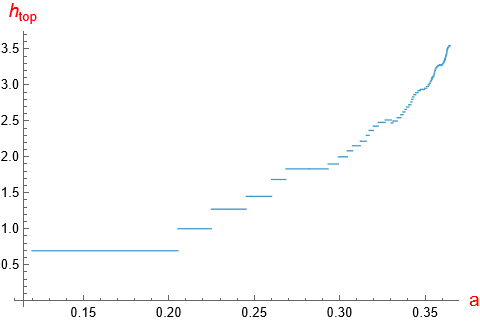

# ENTROPY-GROWTH: supplement to the article 

### Daniel Wilczak, Sergio Serrano and Roberto Barrio<br> A mechanism for growth of topological entropy and global changes of the shape of chaotic attractors

The purpose of this document is to provide

- a short overview of the results proved in the article
- an instruction of how one can compile and run the programs, which validate different properties of the Roessler system
- describe structure and output of the programs

## Table of content

- [The Roessler system](#roessler)
- [The main results about the Roessler system](#results)
  - [Existence of a trapping region](#trapping)
  - [Counting relevant extrema](#extrema)
  - [Existence of saddle-node bifurcations](#bifs)
  - [Lower bound on the topological entropy](#entropy)
- [The C++-17 programs](#program)
  - [Required resources](#requirements)
  - [Building the programs](#gcc)
  - [Source codes](#code)

  
## The Roessler system <a name="roessler"></a>

The 3D Roessler system is an ODE

> $`\frac{d}{dt}x = -(y+1),\quad \frac{d}{dt}y = x+ay,\quad \frac{d}{dt}z=b+z(x-c)`$

We fix the parameter values 

> $`b=0.2,\ c=15`$ 

and study the behaviour the of the system for

> $`a\in [a_{\mathrm{min}},a_{\mathrm{max}}]=[0.12,0.3659].`$ 

We define a Poincare section

> $`\Pi=\{(x,y,z) : y=0 \wedge y'=x<0\}`$ 

and the corresponding Poincare map

> $`P_a:\Pi\to\Pi`$

depending on the parameter $`a`$.


## The main results about the Roessler system <a name="results"></a> ##

We prove 
- the existence of a trapping region for $`P_a`$
- the existence of five saddle-node bifurcations of fixed points for $`P_a`$ and their continuation
- the exact number of so-called relevant extrema for selected parameter values and
- semi-conjugacy of the $`P_a`$ restricted to some invariant set to the Bernoulli shift on 2-13 symbols, depending on parameter value. This leads to a lower bound of the topological entropy.

All the above results are computer-assisted. The C++ programs validates set of inequalities for the Poincare map, from which we can conclude about the results.

### Existence of a trapping region <a name="trapping"></a> ###

We have shown that the rectangle 

> $`T=X\times Z = [-30.53,-3]\times [0.004,0.011]\subset \Pi`$

is a forward invariant set for the Poincare map for all parameter values from the considered range.

Checking that this set is a trapping region reduces to finite set of inequalities, as described in the article. 

In order to run the program call

`./checkTrappingRegion > out/checkTrappingRegion.out`

**Here is a sample output of the program**
>  [**out/checkTrappingRegion.out**](out/checkTrappingRegion.out)

The program executes over two hours on a computer with 144CPUs.


### Counting relevant extrema <a name="extrema"></a> ###

Define 

> $`f_{a,z}(x) = \pi_x P_a(z,z)`$

for $`x\in X`$. For selected parameter values 

> $`a\in\{0.12, 0.2, 0.26, 0.3, 0.32, 0.333, 0.345, 0.35, 0.356, 0.36, 0.362, 0.3659\}`$

we have computed exact number of so-called relevant extrema of $`f_{a,z}`$.

In order to run the program call

`./validateExtrema > out/validateExtrema.out`

**Here is a sample output of the program**
>  [**out/validateExtrema.out**](out/validateExtrema.out)

The program executes 33 minutes on a computer with 144CPUs.


### Existence of saddle-node bifurcations <a name="bifs"></a> ###

We proved that there are five saddle-bifurcations of fixed points of $`P_a`$ in the considered parameter range. 

The following program validates existence of these bifurcations and teh existence of smooth branches of fixed points, as described in the article. 

In order to run the program call

`./validateBifAndPOBranches > out/validateBifAndPOBranches.out`

**Here is a sample output of the program**
>  [**out/validateBifAndPOBranches.out**](out/validateBifAndPOBranches.out)

The program executes 18 minutes on a computer with 144CPUs.


### Lower bound on the topological entropy <a name="entropy"></a> ###

The last program for every parameter value constructs and validates semi-conjugacy between $`P_a`$ restricted to some invariant set to a Bernoulli shift. From this, we can conclude about a lower bound of the topological entropy of $`P_a`$.

In order to run the program call

`./checkConjugacy > out/checkConjugacy.out`

**Here is a sample output of the program**
>  [**out/checkConjugacy.out**](out/checkConjugacy.out)

It contains pairs (parameter range,transition matrix). That is, for specified parameter interval semiconjugacy to a Bernoulli shift with corresponding transition matrix is validated.

The program executes over two hours on a computer with 144CPUs.



## The C++-17 programs <a name="program"></a>

### Required resources <a name="requirements"></a>
- The programs are parallelized by means of the C++17 threading.
- All programs require quite large amount of CPU time. THe reported time of computation is circa **6 hours on 144 CPUs**.
- The computer should support at least **64GB** of RAM memory.

___
### Compilation of the program <a name="gcc"></a>

The program can be compiled and run on any computer running linux or under ubuntu console for MS Windows (WSL2).

The program is based on the [**CAPD library**](https://github.com/CAPDGroup/CAPD) which provides in particular

- interval arithmetics
- data structures and algorithms of linear algebra
- data structures and algorithms for automatic differentiation
- data structures and algorithms for rigorous integration of ODEs
- data structures and algorithms for rigorous computation of Poincare maps

Before you download and compile the CAPD library, check the list of its [**requirements**](http://capd.ii.uj.edu.pl/html/capd_requirements.html)

In an empty directory:

- clone source code of the CAPD library and compile it 
  ```
    git clone https://github.com/CAPDGroup/CAPD
    cd CAPD && mkdir build && cd build 
    cmake .. -DCAPD_ENABLE_MULTIPRECISION=false -DCAPD_BUILD_EXAMPLES=false
    make -j
    cd ../../
  ```
- after succesfull compilation of the CAPD library clone source code of the main programs and compile them
  ```
    git clone https://github.com/dbwilczak/entropy-growth
    cd entropy-growth && mkdir dep && mkdir obj
    make -j
  ```
- After succesfull compilation four executables are created:
  - `checkConjugacy`
  - `checkTrappingRegion` 
  - `validateBifAndPOBranches` and
  - `validateExtrema`
